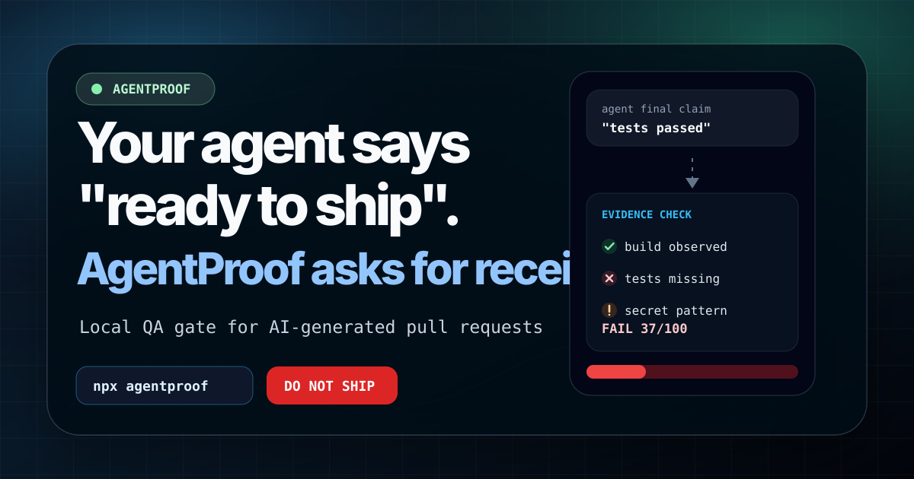

# AgentProof

> Your AI agent says it is done. AgentProof tells you if it is shippable.



AgentProof is a local QA gate for AI-generated pull requests. It checks code, evidence, risk, and the agent's final claim before you merge.

It is not another coding agent. It is the seatbelt for them.

```text
FAIL AgentProof 12/100 - DO NOT SHIP
Report: AGENT_PROOF_REPORT.md
HTML: agentproof-report.html
Findings: 16 (1 critical, 6 high, 6 medium, 3 low)
```

## Why developers might star this

AI agents are fast. That is the problem.

They can produce a useful patch, a broken patch, a risky patch, and a confident final message with the exact same tone. AgentProof gives maintainers a boring, local, reviewable gate between "the agent said it is done" and "we merged it".

The memorable twist: AgentProof does not only inspect code. It also audits the agent's final claim.

```text
Agent: "Tests passed, build passed, lint is clean, ready to ship."
AgentProof: "Show the evidence."
```

Launching or sharing the project? Use the public rollout plan in [`docs/launch-kit/GITHUB_STAR_LAUNCH.md`](docs/launch-kit/GITHUB_STAR_LAUNCH.md).

## 30-second demo

The repo includes two fixtures.

| Fixture | Story |
|---|---|
| `examples/bad-agent-pr` | The agent overclaims completion while risky code remains. |
| `examples/good-agent-pr` | The code is cleaned up and the claim is scoped to evidence. |

Bad agent demo:

```bash
npm run demo:claim
```

Good agent demo:

```bash
npm run demo:good
```

Monorepo demo:

```bash
npm run demo:monorepo
```

Read the full script in [`docs/BEFORE_AFTER.md`](docs/BEFORE_AFTER.md).

## What AgentProof catches

- Failing `typecheck`, `lint`, `test`, and `build` scripts when they exist.
- Token-shaped secrets, committed `.env` files, hardcoded credential-like values, `eval`, and unsafe HTML surfaces.
- AI slop such as `coming soon`, fake testimonials, lorem ipsum, TODO/FIXME, and generic SaaS filler.
- UI hygiene issues such as missing `alt`, empty buttons, and dead `href="#"` links.
- Missing README, weak usage docs, missing license, and weak package metadata.
- Overconfident agent final messages with `--claim`.
- Changed-file PR risk with `--changed --base origin/main`.
- JavaScript monorepo package scripts through workspaces or configured `packages`.
- Team policies with profiles, budgets, suppressions, expiry dates, baselines, and policy packs.
- GitHub-native artifacts: SARIF, HTML report, PR comment, SVG badge, JSON receipt, and history trend.

## Install-free quickstart

New here? Follow the 10-minute path in [`docs/GETTING_STARTED.md`](docs/GETTING_STARTED.md) to run the first scan, try the demo, add CI, and audit an agent final claim.

Want the command menu directly in your terminal?

```bash
npx agentproof --recipes
```

First scan failed and you want the next move?

```bash
npx agentproof --troubleshoot
```

Skeptical or evaluating adoption?

```bash
npx agentproof --faq
```

Privacy-first note: AgentProof runs locally by default and does not send your code to a server. Read [`PRIVACY.md`](PRIVACY.md) before sharing reports, receipts, or workflow artifacts outside your team.

Honest-scope note: AgentProof improves review evidence, but it does not prove software is secure or production-ready. Read [`LIMITATIONS.md`](LIMITATIONS.md) before treating any score as a merge guarantee.

Run against the current project:

```bash
npx agentproof --path . --fail-under 80
```

Run the new DesignGuard for an MVP/SaaS interface:

```bash
npx agentproof --path . --design saas --design-url http://localhost:3000 --profile strict --fail-under 90
```

Run only DesignGuard while still reading local UI source:

```bash
npx agentproof --path ./landing-site --design-only --design landing --design-url http://localhost:3000 --profile strict --fail-under 90
```

Generate an AI rewrite for a failing landing page without applying it:

```bash
npx agentproof design-fix --path ./landing-site --design landing --design-url http://localhost:3000 --design-ai-provider codex-auth --design-ai-model gpt-5.5 --design-ai-reasoning xhigh
```

Apply the rewrite after review:

```bash
npx agentproof design-fix --path ./landing-site --design landing --design-url http://localhost:3000 --design-ai-provider codex-auth --apply
```

Let DesignGuard generate the improvement brief, run AI, and re-score:

```bash
npx agentproof design-improve --path ./landing-site --design landing --design-url http://localhost:3000 --design-ai-provider codex-auth --design-ai-model gpt-5.5 --design-ai-reasoning xhigh --target-score 90 --apply
```

Clone and improve a landing when you only have a public URL and no source files:

```bash
npx agentproof design-fix --path . --from-browser --design landing --design-url https://example.com --design-locale fr-FR --clone-output ./cloned-landing --design-ai-provider codex-auth --apply
```

DesignGuard adds a second gate for UI/product readiness: layout overflow, hero height, CTA position, contrast, typography, spacing, color tokens, product-specific rules, screenshots, optional AI review, optional DesignFix rewrites, and DesignImprove audit->brief->fix->re-score loops. Read [`docs/DESIGN_GUARD.md`](docs/DESIGN_GUARD.md).

Run a static-only scan when you do not want project scripts to execute:

```bash
npx agentproof --path . --no-run-scripts
```

Audit only changed files in a pull request:

```bash
npx agentproof --changed --base origin/main --profile strict
```

Run in observe-only mode while introducing the gate:

```bash
npx agentproof --path . --profile strict --fail-under 85 --observe-only
```

Audit an agent final message:

```bash
npx agentproof --path . --claim .agentproof/final-claim.md
```

Generate a scoped final-claim template:

```bash
npx agentproof --claim-template > .agentproof/final-claim.md
```

Generate review artifacts:

```bash
npx agentproof --path . --github-annotations --sarif agentproof.sarif --html agentproof-report.html --pr-comment agentproof-pr-comment.md --receipt agentproof-receipt.json --summary agentproof-summary.json
```

## One-command project setup

Fastest serious setup:

```bash
npx agentproof --init --all
```

That creates:

- `agentproof.config.json` from the `standard-pr-gate` policy pack;
- `.github/workflows/agentproof.yml`;
- `.agentproof/AGENT_CONTRACT.md`;
- supported agent instruction templates.

Create a config, GitHub workflow, and agent contract:

```bash
npx agentproof --init --policy-pack standard-pr-gate --ci --agent
```

Install copy-paste instruction files for coding agents:

```bash
npx agentproof --init --agents codex,cursor,claude,copilot
```

See available starter policies:

```bash
npx agentproof --policy-packs
```

Recommended packs:

| Pack | Use when |
|---|---|
| `relaxed-prototype` | You want signal on rough demos without blocking too much. |
| `standard-pr-gate` | You want a balanced default for agent-generated PRs. |
| `strict-client-delivery` | You ship production or client work. |
| `security-sensitive` | You touch auth, billing, secrets, infrastructure, or payments. |
| `legacy-adoption` | You need to introduce a gate without pretending legacy debt is gone. |

## Reusable GitHub Action

Minimal PR gate:

```yaml
name: AgentProof

on:
  pull_request:

permissions:
  contents: read
  security-events: write

jobs:
  proof:
    runs-on: ubuntu-latest
    steps:
      - uses: actions/checkout@v4
        with:
          fetch-depth: 0
      - uses: runstudio/agentproof@v1
        with:
          path: .
          profile: strict
          changed: "true"
          base: origin/main
          fail-under: "85"
```

Full artifact workflow:

```yaml
- id: agentproof
  uses: runstudio/agentproof@v1
  with:
    path: .
    profile: strict
    changed: "true"
    base: origin/main
    fail-under: "85"
    baseline: .agentproof/baseline.json
    sarif: agentproof.sarif
    html: agentproof-report.html
    pr-comment: agentproof-pr-comment.md
    receipt: agentproof-receipt.json
    summary: agentproof-summary.json
    history: .agentproof/history.jsonl

- name: Print verdict
  if: always()
  run: echo "AgentProof ${{ steps.agentproof.outputs.score }}/100 - ${{ steps.agentproof.outputs.verdict }}"
```

See [`docs/GITHUB_ACTION.md`](docs/GITHUB_ACTION.md).

## The claim audit

Most QA tools inspect code. AgentProof also inspects the agent's final message.

If the agent writes:

```text
Done. Tests passed, build passed, lint is clean, and this is ready to ship.
```

Run:

```bash
npx agentproof --path . --claim final-message.md --html agentproof-report.html
```

If no passing test, build, or lint command was observed, AgentProof flags the claim as unproven. The goal is simple: final answers should say what the evidence proves, not what the agent hopes is true.

## Receipts for review

Generate a portable receipt:

```bash
npx agentproof --path . --receipt agentproof-receipt.json
```

Verify it later:

```bash
npx agentproof --verify-receipt agentproof-receipt.json
```

A receipt is useful when a human reviewer wants to know what was scanned, which commands were observed, which findings remained, and which verdict was produced.

## CLI highlights

```text
agentproof [options]

-p, --path <dir>             Project directory to audit.
-o, --output <file>          Markdown report path.
--json                       Print machine-readable JSON.
--rules [format]             Print rule catalog as markdown or json.
--explain <rule>             Explain one rule id.
--policy-packs               Print starter policy packs.
--policy-pack <name>         With --init, create config from a policy pack.
--agents [list]              With --init, install agent instruction templates.
--trend [file]               Print trend report from AgentProof history.
--history <file>             Append this run to JSONL history.
--fail-under <n>             Override the score threshold.
--changed                    Scan changed files only.
--base <ref>                 Base ref for changed scans.
--profile <name>             relaxed, standard, or strict.
--baseline <file>            Exclude known findings from active score.
--update-baseline [file]     Capture current findings as known debt.
--sarif <file>               Write GitHub Code Scanning SARIF.
--badge <file>               Write an SVG score badge.
--html <file>                Write a self-contained HTML report.
--pr-comment <file>          Write compact Markdown PR summary.
--receipt <file>             Write portable JSON evidence receipt.
--summary <file>             Write compact JSON summary for bots and dashboards.
--verify-receipt <file>      Verify a JSON evidence receipt.
--claim <text|file>          Audit an agent final claim.
--no-run-scripts             Skip test/lint/typecheck/build scripts.
--doctor                     Explain config and commands without running checks.
--init                       Create agentproof.config.json.
--all                        With --init, create config, CI, agent contract, and agent templates.
--ci                         With --init, create a GitHub workflow.
--agent                      With --init, create an agent contract.
```

## Config example

```json
{
  "profile": "strict",
  "failUnder": 90,
  "maxFiles": 1500,
  "commandTimeoutSeconds": 180,
  "baseline": ".agentproof/baseline.json",
  "ignore": ["fixtures", "snapshots", "generated"],
  "slopPhrases": ["coming soon", "premium experience", "lorem ipsum"],
  "budgets": {
    "critical": 0,
    "high": 0,
    "medium": 6
  },
  "severityOverrides": {
    "security.unsafe-html": "high"
  },
  "suppressions": [
    {
      "id": "slop.generic-copy",
      "file": "docs/internal-drafts/*",
      "reason": "Internal draft copy is allowed before public launch.",
      "expires": "2026-12-31"
    }
  ]
}
```

## Use with coding agents

AgentProof includes a portable skill in [`skills/agentproof/SKILL.md`](skills/agentproof/SKILL.md) and copy-paste templates in [`templates/agents`](templates/agents).

Give it to Codex, Claude Code, Cursor, Gemini CLI, Copilot, OpenCode, or your internal agent harness and set one rule:

```text
Before you claim the task is done, draft your final message into .agentproof/final-claim.md, run AgentProof with --claim, and only then answer the user.
```

Integration templates are available for `AGENTS.md`, Claude Code, Cursor, GitHub Copilot, OpenCode, and internal harnesses. See [`docs/AGENT_INTEGRATIONS.md`](docs/AGENT_INTEGRATIONS.md).

## Docs

| Doc | Purpose |
|---|---|
| [`docs/CLI_REFERENCE.md`](docs/CLI_REFERENCE.md) | Complete CLI flags, exit codes, and command recipes. |
| [`docs/ARCHITECTURE.md`](docs/ARCHITECTURE.md) | Engine flow, module map, public contracts, and extension points. |
| [`docs/BEFORE_AFTER.md`](docs/BEFORE_AFTER.md) | The launch demo script. |
| [`docs/ARTIFACTS.md`](docs/ARTIFACTS.md) | Which report, receipt, SARIF, summary, badge, and history artifact to use. |
| [`docs/ADOPTION.md`](docs/ADOPTION.md) | Three-phase rollout plan for existing teams and legacy repos. |
| [`docs/GITHUB_ACTION.md`](docs/GITHUB_ACTION.md) | Reusable GitHub Action integration. |
| [`docs/PR_COMMENT_WORKFLOW.md`](docs/PR_COMMENT_WORKFLOW.md) | Optional sticky GitHub PR comment workflow. |
| [`docs/CLAIM_AUDIT.md`](docs/CLAIM_AUDIT.md) | Safer final-claim patterns and path resolution. |
| [`docs/AGENT_INTEGRATIONS.md`](docs/AGENT_INTEGRATIONS.md) | Agent instruction templates for Codex, Claude Code, Cursor, Copilot, and harnesses. |
| [`docs/SUMMARY_OUTPUT.md`](docs/SUMMARY_OUTPUT.md) | Compact JSON summary for bots, dashboards, and harnesses. |
| [`docs/POLICY_PACKS.md`](docs/POLICY_PACKS.md) | Starter policy packs. |
| [`docs/SECURITY_MODEL.md`](docs/SECURITY_MODEL.md) | Trust boundaries, redaction, and safe scanning notes. |
| [`docs/CONFIG.md`](docs/CONFIG.md) | Configuration reference. |
| [`docs/VERIFICATION.md`](docs/VERIFICATION.md) | Command evidence and verification behavior. |
| [`docs/MONOREPO.md`](docs/MONOREPO.md) | JavaScript workspace and package detection. |
| [`docs/RULE_GALLERY.md`](docs/RULE_GALLERY.md) | Example-driven gallery of what AgentProof catches. |
| [`docs/RULE_AUTHORING.md`](docs/RULE_AUTHORING.md) | Rule catalog and extension notes. |
| [`docs/DEMO.md`](docs/DEMO.md) | Demo operator script. |
| [`docs/COMPARISON.md`](docs/COMPARISON.md) | Positioning against adjacent tools. |
| [`docs/POSITIONING.md`](docs/POSITIONING.md) | Public messaging, category, and objection handling. |
| [`docs/PUBLISHING.md`](docs/PUBLISHING.md) | Maintainer release guide. |
| [`docs/SUPPLY_CHAIN.md`](docs/SUPPLY_CHAIN.md) | npm/GitHub release trust, provenance, and artifact sensitivity. |
| [`docs/MAINTAINER_PLAYBOOK.md`](docs/MAINTAINER_PLAYBOOK.md) | Launch-week triage, labels, response templates, and merge guardrails. |
| [`docs/PUBLIC_ROADMAP.md`](docs/PUBLIC_ROADMAP.md) | Public roadmap. |

## Positioning

AgentProof is not trying to replace tests, linters, secret scanners, or human review.

It ties those signals together into one agent-focused question:

```text
Can this AI-generated PR be trusted enough to merge?
```

## License

MIT

## Maintainer validation

Before publishing or tagging a release, run:

```bash
npm run validate:release
```

The validation harness intentionally expects bad fixtures to fail the gate.
