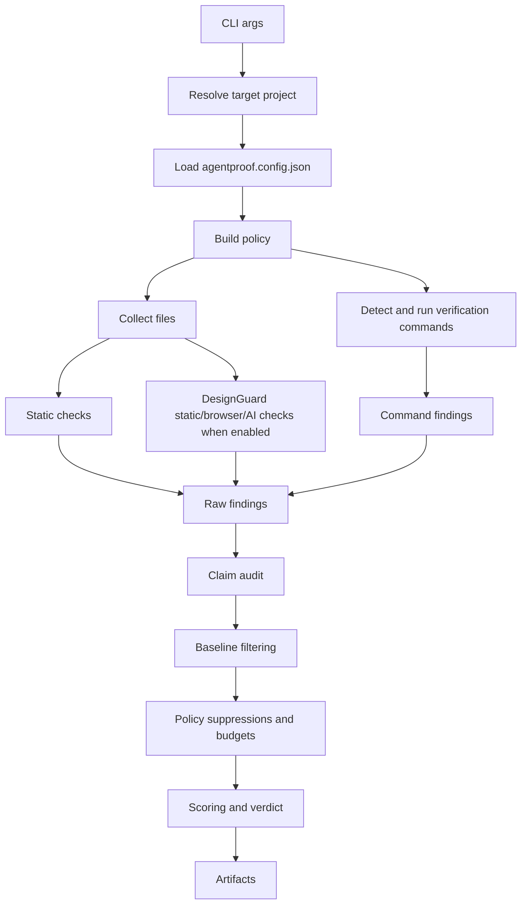

# Architecture

AgentProof is intentionally small: a local Node CLI that turns project evidence into a merge-risk verdict and review artifacts.

The design goal is not to be magical. The design goal is to be explainable enough that maintainers trust the output.

## High-level flow



## Core modules

| Module | Responsibility |
|---|---|
| `src/cli.js` | Parse CLI flags and render help text. |
| `src/index.js` | Orchestrate the run from args to artifacts. |
| `src/files.js` | Resolve target paths, load config, collect files, scaffold configs/workflows/agent instructions. |
| `src/checks.js` | Run static checks against text files. |
| `src/design/*` | Run DesignGuard product/UI readiness checks, browser measurements, screenshots, design scoring, and optional AI review. |
| `src/verification.js` | Detect and run local proof commands. |
| `src/claims.js` | Audit an agent final claim against observed evidence. |
| `src/policy.js` | Build effective profile, budgets, severity overrides, and suppressions. |
| `src/baseline.js` | Load, apply, and update known-debt baselines. |
| `src/scoring.js` | Sort findings and calculate score, counts, verdict, exit code. |
| `src/rules.js` | Public rule catalog and rule explanations. |
| `src/redact.js` | Redact common credential-shaped values before writing artifacts. |
| `src/report.js` | Markdown report and console summary. |
| `src/html.js` | Self-contained HTML report. |
| `src/sarif.js` | SARIF output for GitHub Code Scanning. |
| `src/pr-comment.js` | Reviewer-facing Markdown PR comment. |
| `src/receipt.js` | Portable evidence receipt. |
| `src/summary.js` | Compact JSON summary for bots and dashboards. |
| `src/history.js` | JSONL history and trend reports. |
| `src/doctor.js` | Read-only environment/config explanation. |
| `src/policy-packs.js` | Built-in starter policy configs. |

## Finding shape

Most modules communicate through findings with this shape:

```js
{
  id: 'security.secret-pattern',
  category: 'security',
  severity: 'critical',
  title: 'Possible secret or API token committed',
  file: 'src/app.ts',
  line: 42,
  detail: 'A token-shaped string was found in source.',
  suggestion: 'Rotate the secret and load it from environment variables.'
}
```

Important conventions:

- `id` is public API. Avoid renaming it.
- `severity` must be one of `critical`, `high`, `medium`, `low`, or `info`.
- `file` and `line` should be present when possible.
- `detail` and `suggestion` must not expose secrets.
- Use `redactText` before writing potentially sensitive output.

## Run result shape

`src/index.js` builds one result object and passes it to artifact renderers.

Key fields:

| Field | Meaning |
|---|---|
| `target` | Absolute target project path. |
| `scanMode` | `full` or `changed`. |
| `scannedFiles` | Number of files scanned. |
| `commands` | Verification command results. |
| `claim` | Loaded final claim metadata, if provided. |
| `policy` | Effective policy profile, budgets, overrides, suppressions. |
| `baseline` | Baseline metadata, if configured. |
| `issues` | Active findings after baseline and suppressions. |
| `scoring` | Score, counts, verdict, and exit code. |
| `technicalScoring` | Score for non-design findings. |
| `design` | DesignGuard config, mode, screenshots, findings, and DesignGate score when enabled. |
| `*Path` | Generated artifact paths. |

Artifact renderers should be pure functions over this result object.

## Public contracts

Treat these as stable surfaces:

- CLI flags and exit codes;
- rule ids;
- config schema;
- receipt schema;
- summary schema;
- GitHub Action inputs and outputs;
- artifact names in templates;
- policy pack names.

Breaking changes need changelog and migration notes.

## Adding a static rule

1. Add detection logic in `src/checks.js` or a focused helper module.
2. Emit a finding with stable `id`, clear `title`, `detail`, and `suggestion`.
3. Add the rule to `src/rules.js`.
4. Add a short bad/better example to `docs/RULE_GALLERY.md` when public-facing.
5. Update `docs/RULE_AUTHORING.md` if the rule introduces a new pattern.
6. Add or update a fixture in `examples/` when useful.

## Adding a DesignGuard rule

1. Add static source checks in `src/design/static.js` or rendered checks in `src/design/browser.js`.
2. Emit `category: "design"` with a stable `design.*` id.
3. Include `detail`, `why`, `suggestion`, and `evidence` so reports show the problem, proof, reason, and fix.
4. Add the rule to `src/rules.js` and `docs/RULE_GALLERY.md` when public-facing.
5. Add a good/bad fixture under `examples/design-*` when the rule is important.

## Adding a verification command detector

1. Add detection in `src/verification.js`.
2. Keep the command local and explainable.
3. Avoid network or cloud dependencies in the default path.
4. Set a useful `name`, `label`, `language`, and optional `cwd`.
5. Make sure claim audit can recognize the evidence when relevant.
6. Document it in `docs/VERIFICATION.md`.

## Adding an artifact

1. Create a renderer module in `src/`.
2. Add a CLI flag in `src/cli.js`.
3. Write the artifact in `src/index.js` after the result object exists.
4. Add it to console summary if helpful.
5. Document it in `docs/ARTIFACTS.md`.
6. Add schema docs if bots or dashboards are expected to consume it.
7. Update GitHub Action inputs if CI users should generate it.

## Adding a policy pack

1. Add the config to `src/policy-packs.js`.
2. Add a matching JSON template under `templates/policies/` if useful.
3. Document the use case in `docs/POLICY_PACKS.md`.
4. Keep the posture honest: prototype packs should not pretend to be production gates.

## Safety rules for contributors

- Do not add hidden network calls to the default path.
- Do not execute project scripts in read-only commands such as `--doctor`.
- Do not print unredacted token or credential-like values.
- Do not make claim audit more permissive without a clear reason.
- Do not make generated workflows require write permissions by default.
- Do not rename rule ids casually.

## Validation

Before release, maintainers can run:

```bash
npm run validate:release
```

Bad fixtures are expected to fail. That is the point: release validation checks that AgentProof blocks unsafe agent PRs and passes known-good paths.
